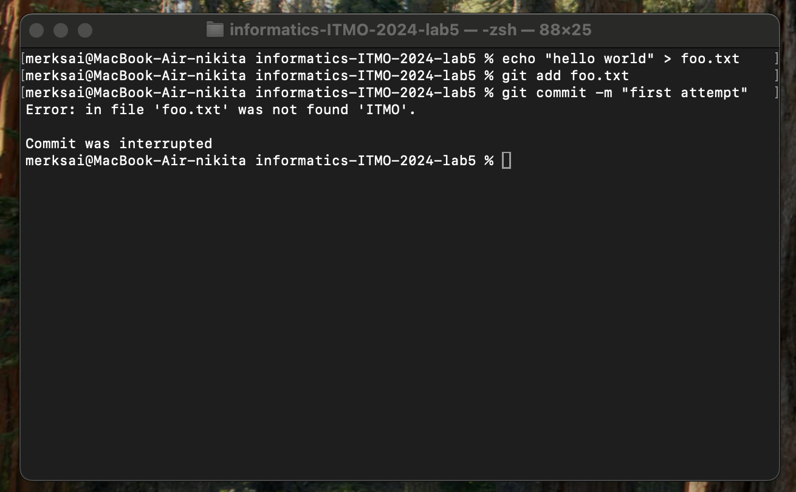
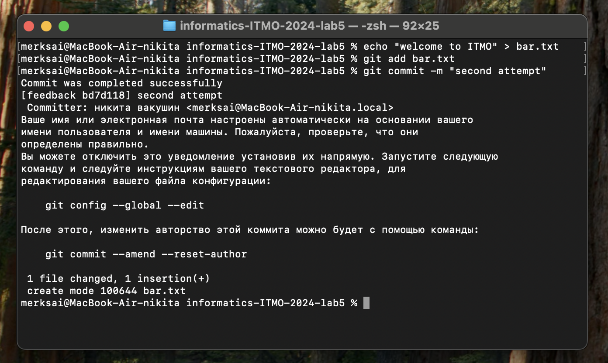
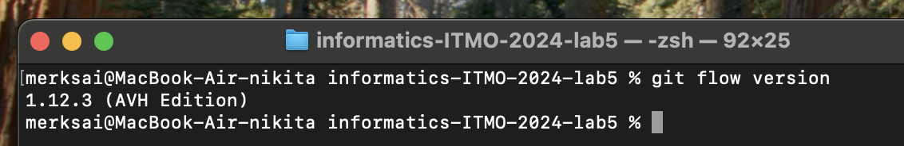

# Лабораторная работа 5

## Шаги работы:

### Задание 1

Будем при коммите проверять наличие слова 'ITMO' во всех .txt файлах. Должно присутсвовать в виде отедельного слова в верхнем регистре.

1. В корне git-репозитория создадим папку ```scripts```, где будет bash-скрипт, выполняющий проверку: ```mkdir -p scripts```.
2. Создадим файл скрипта и напишем его.
```
touch scripts/check-itmo.sh
nano scripts/check-itmo.sh
```
Код проверки:
```
#!/usr/bin/env bash

PATTERN="ITMO"
STAGED_TXT=$(git diff --cached --name-only --diff-filter=ACM | grep '\.txt$')

if [ -z "$STAGED_TXT" ]; then
  exit 0
fi

ERROR_FOUND=0

for FILE in $STAGED_TXT; do
  if [ ! -f "$FILE" ]; then
    continue
  fi

  if ! grep -qi "$PATTERN" "$FILE"; then
    echo "Error: in file '$FILE' was not found '$PATTERN'."
    ERROR_FOUND=1
  fi
done

if [ $ERROR_FOUND -ne 0 ]; then
  echo ""
  echo "Commit was interrupted"
  exit 1
fi

echo "Commit was completed successfully"
```
Пояснения к коду:
- ```git diff --cached --name-only --diff-filter=ACM | grep '\.txt$'``` - получение списка staged .txt
- ```if [ ! -f "$FILE" ]; then continue; fi``` - иногда файл может быть удален или перемещен, а статус в индексе все еще 'A/C/M', в таком случае grep ругается 'файл не найден', поэтому пропускаем
- если ```ERROR_FOUND``` != 0, то хотя бы в одном .txt слово не найдено, и мы сообщаем об этом, ```exit 1``` - git прерывает коммит, иначе ```exit 0``` - git запускает коммит дальше
3. Из корня git-репозитория переходим в ```.git/hooks```: ```cd .git/hooks```.
4. Создадим и напишим файл ```pre-commit```.
```
touch pre-commit
nano pre-commit
```
Код ```pre-commit``` - 'обертка', которая запускает наш скрипт проверки:
```
#!/usr/bin/env bash
/bin/bash "$(git rev-parse --show-toplevel)/scripts/check-itmo.sh"
```
5. Задаем файлам права на исполнение.
```
chmod +x .git/hooks/pre-commit
chmod +x scripts/check-itmo.sh
```
6. Проверяем.



### Задание 2

1. Устанавливаем Git Flow и убеждаемся в его установки.
```
brew install git-flow-avh
git flow version
```

2. В корне репозитория инициализируем Git Flow.
```
git flow init
```
3. Создаем ветку для новой функциональности 'task-management'.
```
git flow feature start task-management
```
5. Вносим изменения в код для добавления функционала управления задачами в файл task_manager.py.
```
def create_task(title, description):
    # Логика создания задачи
    print(f"Создана новая задача: {title}")
```
5. Выполняем коммит изменения.
```
git add task_manager.py
git commit -m "Добавлен функционал управления задачами"
```
6. После завершения разработки функции завершаем фичу и объединяем ее с основной веткой.
```
git flow feature finish task-management
```
8. Переключаемся на ветку 'develop' и начнинаем создание релиза.
```
git checkout develop
git flow release start v1.0.0
```
8. Внесим изменения, связанные с релизом.
```
echo "v1.0.0" > version.txt
git add version.txt
git commit -m "Обновлена версия для релиза v1.0.0"
```
9. Завершаем релиз и объединяем его с ветками 'develop' и 'main'.
```
git flow release finish v1.0.0
```
11. Создаем hotfix.
```
git flow hotfix start hotfix-1.0.1
```
13. Внесим изменения для исправления ошибки и коммитим.
```
nano file_with_error.py
git add file_with_error.py
git commit -m "Исправлена критическая ошибка"
```
12. Завершаем hotfix и объединяем его с ветками 'develop' и 'main'.
```
git flow hotfix finish hotfix-1.0.1
```
14. Отправляем изменения на удаленный репозиторий.
```
git push origin feedback
git push origin develop
git push origin main
```

Результат сделанного задания выгружен в этот репозиторий.
